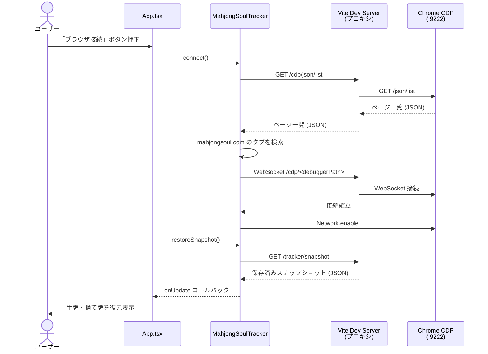
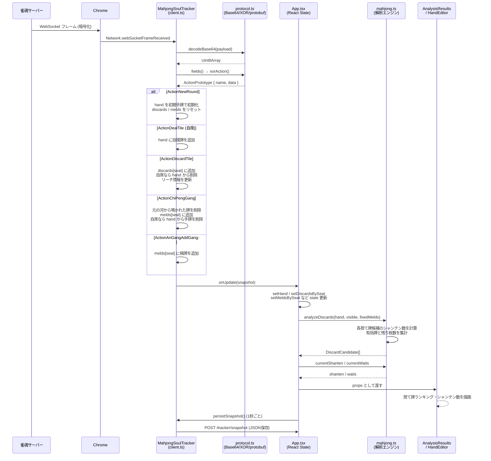

# じゃんたま解析アプリ

雀魂の対局をChrome DevTools Protocol（CDP）経由で読み取り、手牌と捨て牌をアプリへ自動反映するReact + TypeScriptアプリです。

## 起動

Chromeをリモートデバッグポート9222で起動した状態で、次を実行します。

```bash
docker compose up -d
```

ブラウザで <http://localhost:40638> を開き、「ブラウザ接続」を押します。

`scripts/start.py` はWindows向けのChrome起動スクリプトです。ChromeのCDPエンドポイントは `9222` を使用します。

## 現在の実装

- アプリ内の「ブラウザ接続」ボタンから雀魂のタブへ接続
- Viteの `/cdp` プロキシ経由でCDPのCORS制約を回避
- `Network.webSocketFrameReceived` で雀魂のWebSocketを監視
- MajsoulのWebSocketプロトコルのXOR暗号化・`ActionPrototype` 構造を復号
- `ActionNewRound` から初期手牌を取得
- `ActionDealTile` から自分のツモを取得
- `ActionDiscardTile` から全4座席の捨て牌を取得
- `ActionChiPengGang` / `ActionAnGangAddGang` からチー、ポン、明槓、暗槓、加槓を取得
- 鳴かれた牌を元の河から除き、鳴きで公開された牌を鳴いた座席の見えている牌へ移動
- 捨て牌と鳴き牌を分けて保持し、鳴き牌は河の右側に寄せて表示
- 捨て牌と鳴きで公開された牌は解析時に合算
- 捨て牌・見えている牌の欄はデフォルトで閉じた状態
- 取得した状態を1秒ごとにJSON保存
- JSONは `src/src/tracker/game.json` に保存し、Git管理対象外
- JSONは一時ファイルからのリネームで原子的に更新
- 牌パレットによる手動入力UIは削除済み

## データ保存

ブラウザ接続中、Viteの保存APIへ1秒ごとにスナップショットを送信します。保存される内容は次のとおりです。

```json
{
  "hand": ["2m", "3m"],
  "discards": [[], [], [], []],
  "melds": [[], [], [], []],
  "ownSeat": 0,
  "lastEvent": {
    "action": "ActionDiscardTile",
    "seat": 0,
    "tile": "3m"
  },
  "timestamp": 0
}
```

保存ファイル:

```text
src/src/tracker/game.json
```

CDP接続前に到着したWebSocketフレームは再生できません。対局途中から接続した場合、現在の局の初期手牌が復元できず、次の `ActionNewRound` から完全な追跡が始まる場合があります。

## 構成

```text
src/
  src/
    App.tsx
    components/
      HandEditor.tsx
    tracker/
      client.ts       # CDP接続とWebSocket監視
      protocol.ts     # Majsoulの簡易protobuf/XOR復号
      game.json       # 実行時生成、Git管理外
    domain/
    engine/
  vite.config.ts      # CDPプロキシとJSON保存API
docker-compose.yml
scripts/start.py      # Windows向けChrome起動
```

## シーケンス図

### ブラウザ接続フロー



### ゲームイベント処理フロー



## 検証

```bash
cd src
npm run lint
npm run build
```

Docker環境では、アプリコンテナをホストネットワークで起動し、ホストの `127.0.0.1:9222` に接続します。

## 参考

- [Akagi](https://github.com/shinkuan/Akagi) — 雀魂・天鳳向けのリアルタイム麻雀AIアシスタント。MajsoulのWebSocketプロトコル（`ActionPrototype` 構造・XOR暗号化）の解読に使用した。
